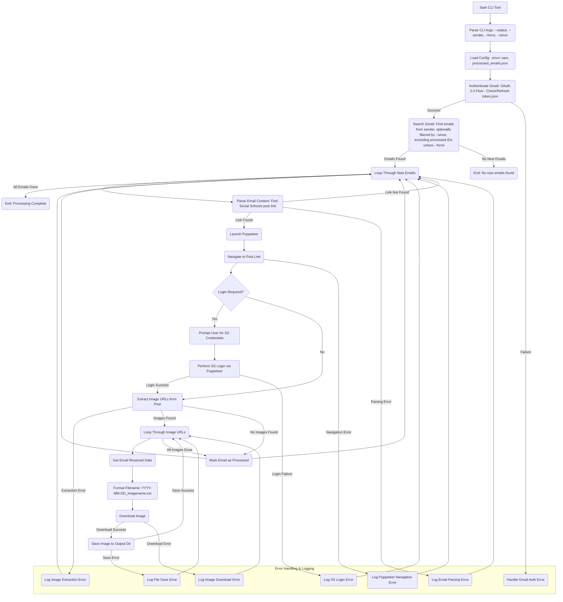

# Plan: Social Schools Photo Downloader CLI

**I. Goal:**

Create a command-line tool that automatically finds Social Schools emails in a specified Gmail account, extracts links to photo posts, navigates to those posts (handling login if necessary), downloads the associated images, and saves them to a user-defined directory with a date prefix in the filename.

**II. Technology Stack:**

*   **Language:** Node.js
*   **Core Libraries:**
    *   `googleapis`: For interacting with the Gmail API.
    *   `puppeteer`: For browser automation (visiting links, logging in, extracting image URLs).
    *   `commander` (or `yargs`): For parsing CLI arguments and options.
    *   `inquirer`: For interactively prompting the user (e.g., for Social Schools credentials).
    *   `fs-extra`: For robust file system operations (creating directories, saving files).
    *   `axios` (or Node.js `https`): For downloading image files.
*   **Environment Management:** `direnv` with `.envrc` file.

**III. Configuration:**

*   **`.envrc` file:** Managed by `direnv`. Store non-sensitive configuration like the default Gmail sender address (`export SOCIAL_SCHOOLS_SENDER_EMAIL="sender@example.com"`). Users need `direnv` installed.
*   **`credentials.json`:** Google Cloud OAuth 2.0 credentials file (obtained by user).
*   **`token.json`:** Stores the user's OAuth access and refresh tokens (generated on first run).
*   **`processed_emails.json` (or similar):** A simple JSON file (e.g., `{"processedIds": ["emailId1", "emailId2"]}`) to store the IDs of emails that have already been processed to avoid redundant downloads.
*   **CLI Arguments/Options:**
    *   `--output <directory>` (Required): Specifies the directory to save downloaded images.
    *   `--sender <email>` (Optional): Overrides the sender email address from `.envrc`.
    *   `--force` (Optional): Ignores the `processed_emails.json` and attempts to process all found emails again.
    *   `--since <YYYY-MM-DD>` (Optional): Only process emails received on or after this date.

**IV. Workflow & Components:**

**V. Key Implementation Steps:**

1.  **Project Setup:** Initialize Node.js project (`npm init -y`), install dependencies (`npm install googleapis puppeteer commander inquirer fs-extra axios`). Set up `.gitignore`. Create initial `.envrc.example`.
2.  **Gmail OAuth Setup:**
    *   Provide clear README instructions for users to create `credentials.json` in Google Cloud Console and enable the Gmail API.
    *   Implement the OAuth 2.0 authorization flow (prompt user to visit URL, get code, exchange for tokens, save to `token.json`). Handle token storage and automatic refresh.
3.  **CLI Interface:** Use `commander` to define and parse arguments (`--output`, `--sender`, `--force`, `--since`). Validate required arguments.
4.  **Gmail Search:** Use `googleapis` (`gmail.users.messages.list`) to search emails based on sender (`from:`), date (`after:`), and exclude processed IDs unless `--force` is used.
5.  **Email Parsing:** For each message ID, fetch the full email content (`gmail.users.messages.get`). Parse the body (handle different content types like HTML/plain text) to reliably extract the specific Social Schools post link. Regular expressions or DOM parsing might be needed.
6.  **Puppeteer Interaction:**
    *   Launch Puppeteer (`puppeteer.launch`).
    *   Create a new page (`browser.newPage`).
    *   Navigate to the extracted post link (`page.goto`).
    *   Detect if a login form is present (e.g., check for specific selectors like `#username`, `#password`).
    *   If login is needed, use `inquirer` to securely prompt the user for credentials. Use Puppeteer (`page.type`, `page.click`, `page.waitForNavigation`) to fill and submit the login form. Handle login errors.
    *   Once on the post page (logged in or not), identify and extract all relevant image `src` URLs (e.g., using `page.$$eval` with appropriate CSS selectors for image elements within the post content).
    *   Close the browser (`browser.close`).
7.  **Image Downloading:**
    *   Fetch the email's internal date using the Gmail API (`internalDate`) and format it as `YYYY-MM-DD`.
    *   For each extracted image URL:
        *   Attempt to derive a meaningful original filename from the URL path or query parameters. If not possible, generate a unique name (e.g., using index or hash).
        *   Construct the final filename: `<output_dir>/YYYY-MM-DD_<original_or_generated_name>.<extension>`. Handle potential filename conflicts gracefully (e.g., append `-(1)`, `-(2)`).
        *   Download the image data using `axios` (set `responseType: 'stream'`).
        *   Save the image stream to the specified output directory using `fs-extra.createWriteStream`. Ensure the output directory exists (`fs-extra.ensureDir`).
8.  **State Management:** Before processing, read `processed_emails.json`. After successfully processing all images for an email, add its ID to the list and write the updated list back to `processed_emails.json`.
9.  **Error Handling:** Implement comprehensive `try...catch` blocks for API calls, network requests, file operations, parsing, and Puppeteer actions. Log errors clearly to the console, indicating which email or image failed.
10. **User Feedback:** Provide informative console logs about the tool's progress (e.g., "Authenticating Gmail...", "Found X new emails", "Processing email ID: ...", "Navigating to post...", "Logging into Social Schools...", "Found Y images in post", "Downloading image Z...", "Saved image to ...", "Finished.").

**VI. Next Steps (Post-Plan Approval):**

1.  Refine the exact CSS selectors needed for parsing email bodies and scraping Social Schools pages (requires manual inspection of actual emails and pages).
2.  Finalize the strategy for handling filename conflicts.
3.  Begin implementation in Code mode.